Notes and key ideas from [Google UX Design Professional Certificate](https://www.coursera.org/professional-certificates/google-ux-design).

## Course 1: Foundations of UX Design

Careers in UX design:

- **Interaction designers** focus on the experience of a product and the user flow that a typical user takes to complete a task on an app, website, or other platform.
- **Visual designers** focus on how a product or technology looks (logos, illustrations, icons, font color, size, and placement, layout of each page or screen).
- **Motion designers** create smooth transitions, animations or visual effects to bring their design ideas to life.
- **VR/AR designers** create products that provide users with immersive experiences, unbounded by the limits of the physical world.
- **UX researchers** conduct studies or interviews that examine how people use a product, and identify pain points that users are experiencing.
- **UX writers** make the language within a product clearer so that the user experience is more intuitive.
- **UX program managers** ensure clear and timely communication by setting goals, writing project plans, and allocating team resources.
- **UX engineers** translate the design’s intent into a functioning experience. They help UX teams figure out if designs are intuitive and technically feasible.
- **Conversation designers** leverage user research, psychology, technical knowledge, and linguistics to enable natural conversations with things like voice assistants. Conversation designers develop the “persona” as well as the flow and dialog of the interaction.

Responsibilities of an entry-level UX designer:

- User research
- Information architecture (IA)
- Wireframing
- Protyping
- Visual design
- Effective communication

Depending on whether you work at a startup, a small company or a big company, your job as a UX designer could be quite different! This may affect your growth, creativity, impact, speed, responsibilities, specialization, networking, exposure, autonomy, schedule, or experience.

### Specialist vs generalist designers

- **Specialist**: expert at one thing.
- **Generalist**: broad number of reponsibilities.
- **T-shaped**: Expert at one thing and capable of a lot of other things.

### Five stages of product development lifecycle

- **Brainstorm**
- **Define**
- **Design**
- **Test**
- **Launch**

### Characteristics of a good user experience

- **Usable**: design, structure, and purpose of the product is clear and easy to use.
- **Equitable**: helpful to people with diverse abilities and backgrounds.
- **Enjoyable**: the design delights the user.
- **Useful**: it solves user problems.

### User-centered design

A **user** is a person who is trying to solve a problem and is looking for a product or service to help them solve it. The **user experience** is the journey that the user takes with that product or service. As a UX designer, your goal is to **keep the user at the center of every decision you make**, and to do that, you need to get to know your user. Consider the following questions:

- Do my users have impairments or disabilities to consider–whether temporary, situational, or permanent?
- How familiar are my users with technology?
- How are my users accessing the product or service?
- Where and when are my users accessing the product or service?
- Have I considered all my potential users?

Assistive technology (AT) is used to describe any products, equipment, and systems that enhance learning, working, and daily living for people with disabilities. Examples: color modification, voice control, screen readers, alternative text, reminder alarms and Augmentative and Alternative Communication (AAC) devices.

### Design Thinking

The Design Thinking framework is a user-centered approach to problem-solving that includes activities like research, prototyping, and testing to help you understand who your user is, what their problems are, and what your design should include. It involves the following phases:

- **Empathize**: learn more about the user and their problems, wants, and needs, and the environment or context in which they’ll experience your design. Step away from your assumptions and guesses and let your research findings inform your decision-making.
- **Define**: analyze your research findings from the empathize phase and determine which user problems are the most important ones to solve, and why.
- **Ideate**: come up with as many design solutions as possible with collaborative brainstorming with other members of your team—don’t settle for your first solution because the most obvious solution is not always the right one.
- **Prototype**: produce an early model of a product that demonstrates its functionality and can be used for testing.
- **Test**.

---

- **Universal design**: the process of creating one product for users with the widest range of abilities and in the widest range of situations.
- **Inclusive design**: making design choices that take into account personal identifiers like ability, race, economic status, language, age, and gender.
- **Equity-focused design**: designing for groups that have been historically underrepresented or ignored when building products. **Equality vs equity**: Equality means providing the same amount of opportunity and support to all segments of society. Equity means providing different levels of opportunity and support for each person in order to achieve fair outcomes.

To design cross-platform experiences, consider the screen size, interaction, layout, functionality.

### Design sprints

A design sprint is a time-bound process with five phases typically spread out over five full, eight-hour days. The goal of design sprints is to solve a critical design challenge through designing, prototyping, and testing ideas with users. Design sprints generally include five phases: understand, ideate, decide, prototype, and test.

A **retrospective** is a collaborative critique of the design sprint.

- What went well?
- What can be improved?

### UX research

Your product design should be built upon research and facts, not assumptions.

UX research focuses on understanding user behaviors, needs, and motivations through observation and feedback. UX research aligns what you, as the designer, _think_ the user needs with what the user _actually_ needs.

- **Foundational research**: What should we build? What are the user’s problems? How can we solve those problems? Am I aware of my own biases, and am I able to filter them as I do research? Methods: interviews, surveys, focus groups, competitive audits, field studies, diary studies, etc.
- **Design research**: How should we build it? Methods: A/B testing, Cafe studies, card sorting, intercepts, etc.
- **Post-launch research**: Did we succeed? Methods: A/B testing, usability studies, surveys, logs analysis, etc.

Types of research:

1. Based on who conducts the research

- **Primary research**: research you conduct yourself (interviews, surveys, or usability studies, etc).
- **Secondary research**: research that uses information someone else has put together (books, articles, or journals, etc).

2. Based on the type of data collected

- **Qualitative research** is primarily collected through observations and conversations. Qualitative research is based on understanding users’ needs and aims to answer questions like “why” or “how did this happen?”

- **Quantitative research** focuses on data that can be gathered by counting or measuring. Quantitative research is based on numerical data that’s often collected from large-scale surveys. This type of research aims to answer questions like “how many?” and “how much?”

### Preventing biases in UX research

- Choose your words carefully.

  Choosing leading words can cause the **framing effect**, where users make a decision or choice based on the way information was presented to them.

  Bad: Do you like or dislike the **improved** layout of these buttons? 
  Good: Explain how you feel about the layout of the buttons.

- Foster independent thinking.

  Group interviews can be affected by the **bandwagon effect**.

- Avoid specific language.

  Be careful to avoid **confirmation bias**, which is trying to find evidence to prove a hypothesis you already have.

- Limit the guidance you give users.

  Be cautious to avoid experiencing any **false consensus**, which is the assumption that others will think the same way as you do.

- Consider users’ tone and body language.

  To avoid experiencing **implicit biases**, which are based on the collection of attitudes and stereotypes you associate with people without your conscious knowledge, it’s important to clarify when you think you’re getting mixed signals from a participant.

- Be careful of your own body language and reactions.

  **Social desirability bias** can happen when a participant answers a question based on what they think you want to hear.

- Plan your research effectively.

  **Availability bias** occurs when you rush the user recruitment process or skip screener questions to attract a bigger pool of users, even if they don’t fit the qualifications or characteristics that you’ve already determined are present in your ideal user.

- Remain open minded.

  Treat all information equally to avoid both **primacy bias**, which is remembering the first user more than others, and **recency bias**, which is most easily remembering the last thing you heard.

---

## Course 2: Start the UX Design Process: Empathize, Define, and Ideate

## 1. Empathize

### How to empathize with users

1. Ask lots of questions. Don't make assumptions, instead ask questions that begin with what, how, and why to gain a deeper understanding of your users’ perspective.
2. Become more observant. Focus on the whole user and their interactions with your product and not just their words.
3. Be an active listener.
4. Request input. Request input from a variety of sources and a diverse group of users using open-ended questions.
5. Have an open mind. Beware of your own biases.
6. Keep current on UX research.

### Empathy vs sympathy

- Empathy: Understanding someone’s feelings or thoughts, often by feeling the emotions yourself.
- Sympathy: Experience of showing concern or compassion without feeling the emotions themselves.

### Determine research goals

Are there certain user problems or pain points that you need to empathize with?

- I want to understand the processes and emotions that people experience around the problem my product is trying to solve.
- I want to identify common user behaviors and experiences with tasks that my product is trying to address.
- I want to understand user needs and frustrations as they relate to the product I’m designing.

### Write interview questions

- Ask open-ended questions.
- Keep questions short and simple.
- Ask follow-up questions.

### Empathy maps

Empathy maps are easily understood charts that explain what UX designers have learned about a particular type of user. Two types of empathy maps: **one-user empathy maps** and **aggregated empathy maps** (represent a group of users who share similar thoughts, opinions, or qualities).

Template for empathy maps:

1. Add the user's name
2. 4 squares:
   - **SAYS**: Verbatim qoutes from the user.
   - **THINKS**: Summarize thoughts expressed by the user.
   - **DOES**: Details on steps and actions taken by the user to overcome the problem.
   - **FEELS**: Feelings expressed by the user. Might overlap with the contents of the **THINKS** section.

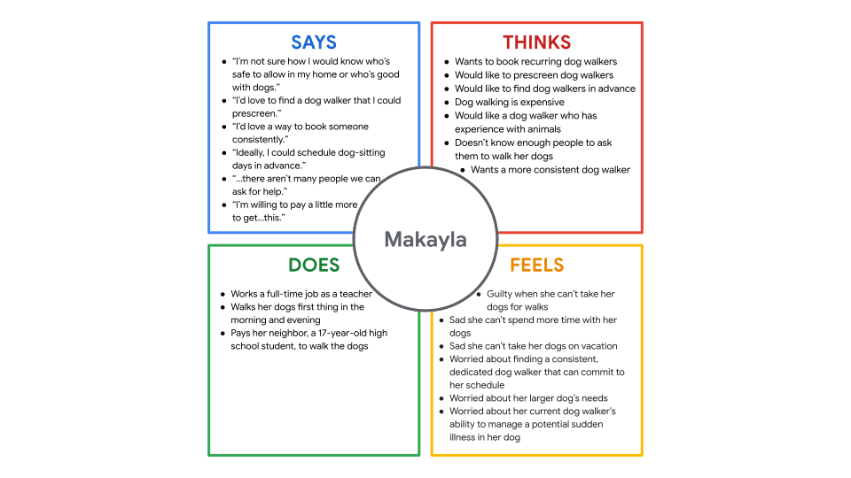

### Identify user pain points

Pain points are UX issues that frustrate and block the user from getting what they need from a product.

Pain points fall into 4 categories:

1. **Financial**, or money-related pain points.
2. **Product**, which are pain points related to quality issues.
3. **Process**, which are pain points related to the user’s journey.
4. **Support**, which are pain points related to getting help from customer service.

### Personas

Personas are fictional users whose goals and characteristics represent the needs of a larger group of users. Personas are created by conducting user research and identifying common pain points, and represent overview of all of your research and interviews.

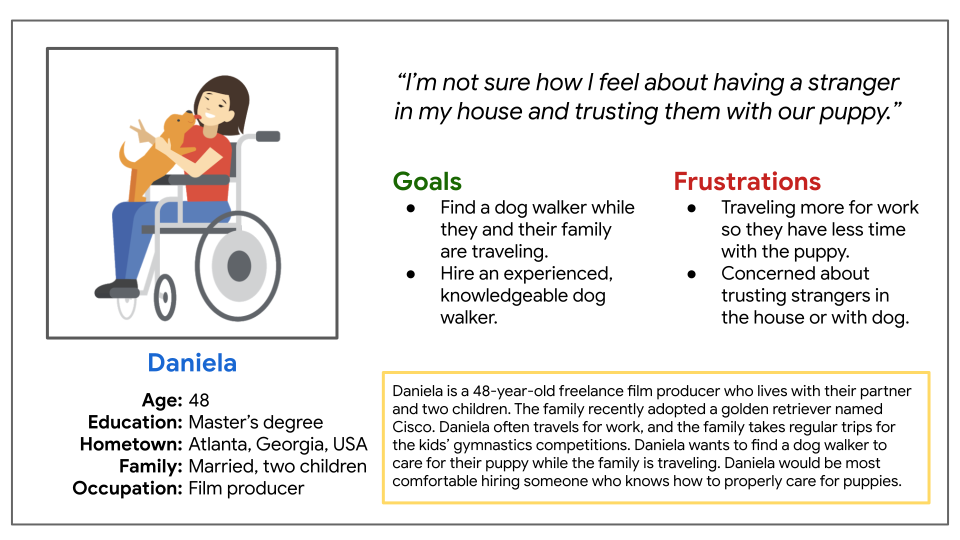

### User stories

A user story is a fictional one-sentence story told from the persona’s point of view to inspire and inform design decisions.

Format for writing a user story:

> As a **type of user** (who), I want to **action** (what) so that **benefit** (why).

Example: As a frequent traveler, I want to hire a consistent dog walker so that I can feel comfortable about the safety of my pets while I'm on vacation.

#### Consider edge cases

An edge case is a rare situation or unexpected problem that interrupts a standard user experience. Example: User lives in London but the "Home state" field on a form is mandatory.

So, make sure your personas and user stories account for a wide variety of users and problems, thoroughly review the project before launch, and use wireframes.

### User journey maps

- Step 1: Add each action in the journey until the user reaches their goal.
- Step 2: Add descriptions for each action.
- Step 3: Add how the user feels at each point.
- Step 4: Add opportunities for improvement.

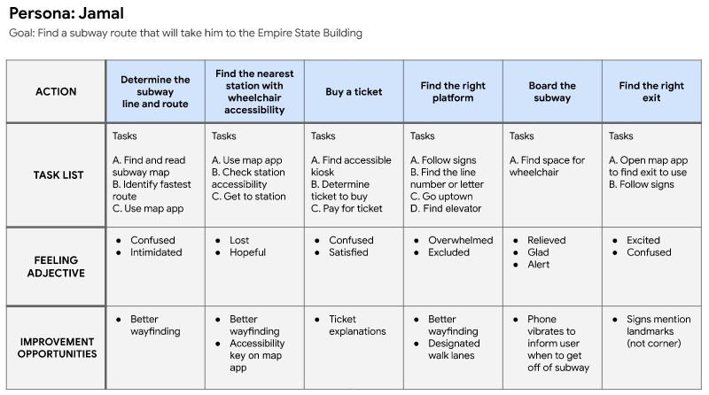

### Acessibility

Accessibility is the design of products, devices, services, or environments for people with disabilities (permanent, temporary, or situational).

- Use assistive technologies.
- Put emphasis on inclusive design.
- Understand the [curb cut effect](https://en.wikipedia.org/wiki/Curb_cut_effect).

Examples:

- **Touch** (user who can only use one arm [amputee, injury, parent carrying a child with one hand, etc]):
  - Consider hand sizes when placing buttons.
  - Add double taps feature to avoid accidental icon clicks.
  - Enable the one-handed keyboard feature and general keyboard compatibility.
  - Allow button customization for easy access to information that the user finds most important.
- **Vision** (visually impaired user [blindness, distracted driver, etc]):
  - Use a larger font.
  - Ensure images have alternate text/labels to be read by a screen reader (only include descriptions when necessary).
  - Detect whether the user is operating a motor vehicle.
  - Use high contrast colors.
  - Don’t rely on text color to explain navigation, warnigs, or next steps. Instead, include explicit instructions.
  - Use **cutomizable text**, allowing users to change how text is displayed (color/font/size/spacing of the text) in order to read the text more easily.
- **Hearing** (auditorily impaired user [nonverbal, laryngitis, non-native speaker, etc])
  - Provide written descriptions in addition to video.
  - Provide **Real-Time Texting** during phone calls with users or with app support.
  - Arrange alternatives for automated systems that rely on speech recognition.
  - Provide an in-app messaging system that allows the use of emojis and image uploads.

## 2. Define

### Problem statements

Problem statements provide a clear description of the user’s need that should be addressed, clarify your users’ goals, and help UX designers identify constraints that prevent users from meeting those goals. Problem statements also help your team measure success.

To build a problem statement, you can utilize the 5 Ws framework.

### The 5 Ws and H: who, what, when, where, why, and how

- **Who** is experiencing the problem?
- **What** are the pain points you’re trying to solve?
- **Where** is the user when they’re using the product?
- **When** does the problem occur? Maybe it’s right after the end of a long and tedious process, or maybe it’s something that happens daily.
- **Why** is the problem important?
- **How** are users reaching their goals by using the product?

Format for writing a problem statement:

> [user name] is a/an [user characteristics] who needs [user need] because [insight].

Example: **Arnold** is a **busy executive** who needs **an easy app experience to hire a dog walker** because **he's not technologically savvy**.

### Hypothesis statements

A hypothesis statement is an educated guess about what you think the solution to a design problem might be. They help you narrow down your research insights into goals for your product, so you can stay focused on the wants and needs of your users.

Two common methods:

1. **if/then** (address direct needs of user)

- **If** Arnold downloads the dog walker app, **then** they can utilize the “simplified” mode setting to view only the basic app functions.
- **If** Tobias signs up for the dog walker app, **then** they will quickly and easily pick a walker that fits their schedule.

2. **we believe that** (taking team's perspective into account)

- **We believe that** a simplified mode of the dog walker app **for** Arnold **will** allow them to hire dog walkers efficiently.
- **We believe that** easy access to available dog walkers **for** Tobias **will** increase the amount of walks they choose for their pets.

### Determine a value proposition

Value propositions summarize why a consumer should use a product or service.

- **What does your product do?** Clearly explain the offering that your product provides users.
- **Why should the user care?** Describe how your product addresses users’ pain points.

How to determine value proposition:

- Step 1: **Describe your product’s features and benefits.** Create a list of all the great features and benefits of your product, big and small.
- Step 2: **Explain the value of the product.** Sort the output from step 1 into categories of product values (accessibility, cost, reliability, professional experience, etc). Remove items that don't add real "value" for users.
- Step 3: **Connect these features and benefits with the needs of your users.** To determine value, pair each persona with a value proposition that meets their biggest pain point.
- Step 4: **Review your official value proposition list.** Identify your app’s unique value proposition. Consult the reviews shared on competitors' products.

### Influence of psychology in UX design

Some of the human factors that inform design: impatience, limited memory, needing analogies, limited concentration, changes in need, needing motivation, prejudices, fears, making errors, and misjudgment.

Example: use of TL;DRs

- Mental models: internal maps that allow humans to predict how something will work.
- Feedback loops: the outcome a user gets at the end of a process. If your user takes an action, provide some kind of confirmation that the action worked or that it didn't.
- **Von Restorff effect** or **isolation effect**: When multiple similar objects are present, the one that differs from the rest is most likely to be remembered. This is why call-to-action (CTA) buttons look different from the rest of the buttons.
- **Serial position effect**: When people are given a list of items, they are more likely to remember the first few and the last few, while the items in the middle tend to blur. This is why most applications and websites position the most important user actions toward the far right or far left of a top navigation bar.
- **Hick's law**: The more options a user has, the longer it takes for them to make a decision.

Don't exploit the user, encourage them. Don't overpower the user, empower them.

## 3. Ideate

### Design ideation

Design ideation is the process of generating a broad set of ideas on a given topic without judging or evaluating them.

Preparation for ideation:

- Empathize with users.
- Define the problem.
- Establish a creative environment.
- Set a time limit.
- Assemble a diverse/inclusive team.
- Think outside the box.

Come up with as many ideas as you can even if they seem ridiculous at first. The list of your ideas will be narrowed down when you have to think about constraints, like budget and timelines, equitability, and when users test those ideas.

We need to consider both the business needs and the user's needs when designing. Voice and tone have a huge impact on a user's experience with a product. Knowing the successes and failures of your competition can also help influence your design decisions.

### Competitive audits

A competitive audit is an overview of your competitors’ strengths and weaknesses.

**Direct competitors** are companies that have offerings similar to your product and focus on the same audience. **Indirect competitors** can have a similar set of offerings and a different audience, or a different set of offerings with the same audience.

Benefits of competitive audits:

- Giving you an idea of products already in the market and their designs.
- Suggesting ideas to solve early problems that you’re facing with your own designs.
- Revealing the ways that current products in the market are not meeting users’ needs. This is a gap for your product to address!
- Demonstrating the expected life cycle of a product in the same market as yours.
- Informing all the different iterations your product could take and how those performed for your competitors.

Limitations of competitive audits:

- Can stifle creativity.
- Depends on how well you interpret the findings.

Steps to conduct a competitive audit:

1. Outline the audit goals. Is it to compare the user experience of competitor's website, visual design, or something else.
2. List competitors.
3. Determine the specific competitor aspects you want to compare. Rate competitors based on **first impressions**, **interaction**, **visual design** and **content**. Use consistent language/scale for rating competitor products (For example: Needs work, Okay, Good, Outstanding).
4. Research each company. Include notes, links, and screenshots.
5. Summarize your findings in a report.

Presenting a competitive audit:

- Get feedback from your team.
- Limit the amount of text on your slides.
- Stick to the highlights.
- Use notes.
- Practice ahead of time.
- Use relevant graphics.
- Keep your biases in check.
- Be able to defend your conclusions.

### Brainstorm design ideas by sketching

#### How Might We (HMW)

HMW is a design thinking activity used to translate problems into opportunities for design. During a HMW exercise, you’d create a list of questions that start with “How might we” and use those to spark ideas for solutions.

To create good HMW questions, you need a well-defined problem statement.

Example: Darren is a concert goer who needs to keep track of their concert ticket because they need the ticket when they go through security.

Tips to create good HMW questions:

- Amp up the good.
  > How might we make keeping track of tickets a fun competition among friends?
- Explore the opposite.
  > How might we create a way to lose tickets?
- Change a status quo.
  > How might we make a non-paper concert ticket?
- Break the point-of-view into pieces.
  > How might we keep the customer’s ticket from getting lost? How might we make a lost ticket easier for the security team to handle?
- Remove the bad.
  > How might we make a way for concert goers to enter a venue without needing a ticket?
- Go after the adjective.
  > How might we make the entry to a concert venue less stressful for ticket holders?
- Question an assumption
  > How might we remove the security check process at a concert?
- Create an analogy using the established need or context
  > How might we make going through security like playing a video game?
- Identify unexpected resources that can provide assistance
  > How might facial recognition software help manage concert entry?

Best pratices for thinking of HMWs:

- Be broad. A good HMW should allow for multiple solutions.
- But don't be too broad.
- Make multiple drafts.
- Be creative.
- Write as many HMWs as you can.

#### Crazy Eights

Crazy Eights is a design ideation exercise intended to help you generate several ideas in a small amount of time, forcing you to think outside the box.

How it works:

- Start with a large sheet of paper. Fold the paper in half, then fold it in half again, then in half one more time. When you unfold the paper, you’ll have eight squares to sketch in.
- Grab something to draw with like a Sharpie or a pencil.
- Set your timer to eight minutes. You’ll have one minute to sketch each design idea.
- Let the ideas flow. Draw any and every solution that comes to your mind. If you have more than eight ideas, feel free to repeat the exercise.

Best practices:

- Do a creative warm-up exercise.
- Make sure your problem is well defined.
- Don’t judge your ideas.
- Don’t judge other people’s ideas.
- Include a diverse group.
- Ideate in a comfortable environment.
- Don’t be afraid of sketching.

---

## Course 3: Build Wireframes and Low-Fidelity Prototypes

### Goal statements

A goal statement is one or two sentences that describe a product and its benefits for the user. It covers who the product will serve, what the product will do, and why the product solves the user’s need. You can use a problem statement and/or various other parts of your research to build a goal statement.

Format for writing goal statements:

> Our [product] will let users [perform specific actions] which will affect [describe who the action will affect] by [describe how the action will positively affect them]. We will measure effectiveness by [describe how you will measure the impact].

Example: Our **TradeConference app** will let users **expand their business** which will affect **how business owners connect with new clients** by **giving them the ability to connect with clients at local trade shows**. We will measure effectiveness by **analyzing show attendance**.

### User flow

A user flow is the path taken by a typical user on an app or a website, so they can complete a task from start to finish.

Common shapes like circles, rectangles, diamonds, and lines with arrows can be used to outline user flows.

- Circle (Action): The actions users take when moving through a product design.
- Rectangle (Screen): The screens that users will experience while completing tasks.
- Diamonds (Decision): Points where users must ask a question and make a decision.
- Arrows (Direction): **Solid lines** indicate forward direction, and the **dotted lines** indicate backward direction.

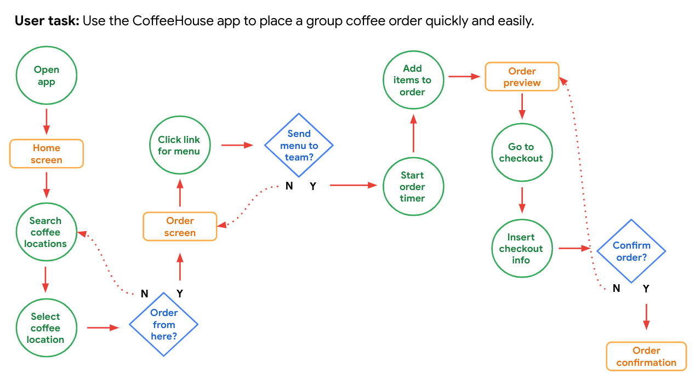

### Storyboards

A storyboard is a series of panels or frames that visually describes and explores a user’s experience with a product. Four key elements of story boards:

- **Character**: States the user in the storyboard.
- **Scen**e: Gives designers a way to imagine the user’s environment.
- **Plot**: Describes the solution or benefit offered by the design.
- **Narrative**: Describes the problem the user is facing and how the design will solve this problem.

Types of storyboards:

- **Big picture storyboards** focus on what the user needs, their context, and why the product will be useful to the user. Big picture storyboards are often used early in the design process when designers are trying to get stakeholders to support their ideas.
  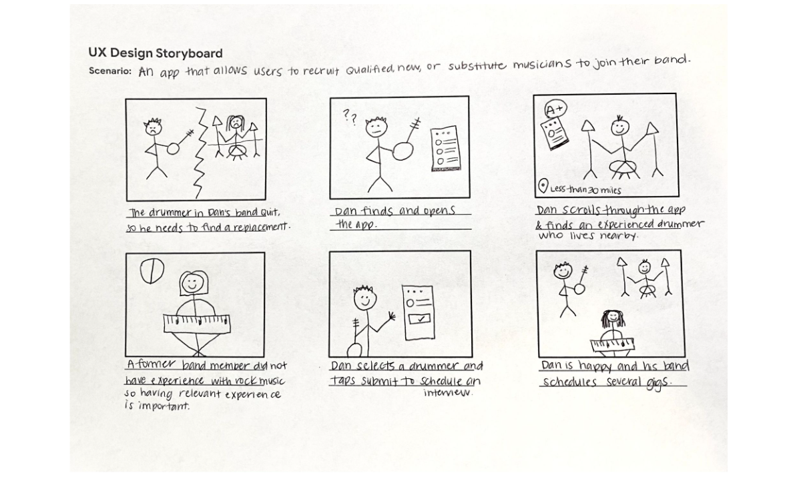

- **Close-up storyboards** concentrate on the product and how it works. They’re best used in the middle to the end of the design process.

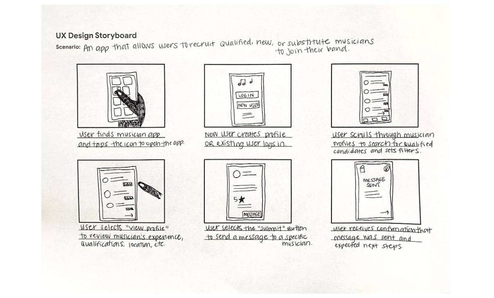

### Wireframing

A wireframe is a basic outline of a digital experience, like an app or website. Industry standards for creating wireframes:

- Body text is represented by horizontal lines. (Short labels and headings are written out.)
- Images, photos, illustrations, and icons are represented by squares with large Xs drawn on top of them. (Simple shapes, like menu icons, can be drawn as they appear.)
- Calls to action—like “submit” or “compose” buttons—are represented by rectangles or circles, whichever fits the basic shape the element has on the screen.

Example of a paper wireframe: 
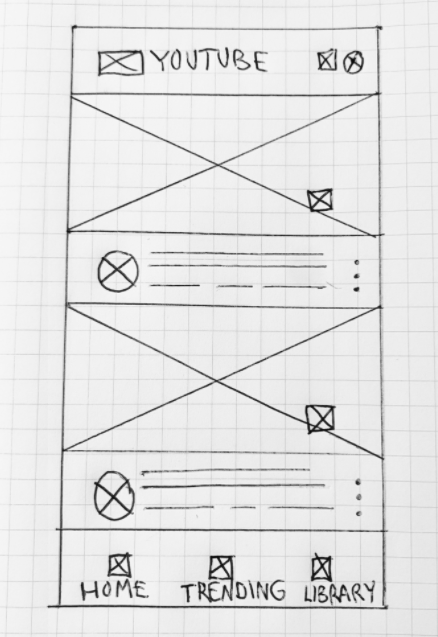

You can use a tool like Figma to create digital wireframes.

### Information architecture

Information architecture is the process of organizing information, so users can successfully experience and interact with the app or website. Information architecture is made up of three pieces:

- **Organization**: how different pieces of information connect in a product.
- **Hierarchy**: tree structure where a larger category is placed at the top and specific categories related to the overall category are placed underneath. Peer information is placed side by side (or on the same level as each other).
- **Sequence**: enables users to move through an app via certain orders or steps.

8 basic principles of IA:

- **Object principle**: You should view your content as “living” and as something that changes and grows over time.
- **Choice principle**: People think they want to have many choices, but they actually need fewer choices that are well-organized.
- **Disclosure principle**: Information should not be unexpected or unnecessary.
- **Exemplar principle**: Humans put things into categories and group different concepts together.
- **Front door principle**: People will usually arrive at a homepage from another website.
- **Multiple classification principle**: People have different ways of searching for information.
- **Focused navigation principle**: There must be a strategy and logic behind the way navigation menus are designed.
- **Growth principle**: The amount of content in a design will grow over time.

These principles help guide the process of building an effective sitemap.

### Gestalt principles

Gestalt Principles describe how humans group similar elements, recognize patterns, and simplify complex images when we perceive objects.

- **Similarity** means that elements that look alike (in shape, size, or color, for instance) are perceived to have the same function.
- **Proximity** means that elements that are close together appear to be more related than things that are spaced farther apart.
- **Common region** means that elements located within the same closed area are perceived to be grouped together.
- **Closure** means that when a human looks at an incomplete object, they subconsciously complete the image to see a whole, completed object.
- **Continuity** means that elements that are arranged in a line or on a curve appear to be more related than elements not on the line or curve.
- **Symmetry** describes that elements are more visually pleasing when the parts of an object are balanced or are mirror images of each other. On the other hand, **asymmetry**, which is a lack of balance and equality, can emphasize an element's importance and create visual interest.

### Implicit bias in UX research

Implicit biases are the collection of attitudes and stereotypes we associate with people without our conscious knowledge. Whether positive or negative, these biases can unconsciously be mistaken for truth when in reality they aren't.

When creating personas, UX designers need to be as inclusive as possible. We shouldn't assume that a certain ethnicity, gender, age, ability or socioeconomic group is or isn't part of our audience.

### Deceptive/Dark patterns

Deceptive patterns can include a range of visual, interactive, audio, or motion elements that are added to designs to deceive and trick users into unintentionally completing an action online. Some common examples:

- **Forced continuity**: The practice of charging a user for a membership without a warning or a reminder.
- **Sneak into basket**: When a user has to remove an item from their cart if they don’t want to buy it, which is an extra step that could be easily missed.
- **Hidden costs**: Hidden or unexpected charges in the user’s cart that are not revealed until the end of the checkout process.
- **Confirmshaming**: When users are made to feel guilty when they opt out of something.
- **Urgency**: Attempting to convince users to purchase an item before they run out of time and miss today’s “amazing” price.
- **Scarcity**: When a website makes users very aware of the limited number of items in stock.

### Attention economy

Attention economy refers to the battle over users’ attention. It revolves around the human attention span and how products compete to capture that attention. The term was first coined by psychologist and Nobel Laureate Herbert A. Simon who said,

> A wealth of information creates a poverty of attention.

UX designers should be careful not to design their products in a way that encourages addictive behaviors or FOMO (fear of missing out).

### Ethical design

Ethical design is about understanding how your design work affects the world. This means considering **marginalized/underrepresented population**, **edge cases**, **inclusiveness**, **accountablity**, and the effects of **dominant culture** while creating personas. You should broaden your definition of a **stakeholder** as any person or place that a project can affect, rather than people in high-level decision-making roles. You should increase collaboration and think beyond universal design (one design method works for many users) and consider **multiversal** solutions (many ways that a design works for different people by having more than just one point of entry or more than one way to meaningfully experience it).

---

## Course 4: Conduct UX Research and Test Early Concepts

### Research study

A research study is a step-by-step examination of a group of users and their needs, which adds realistic context to the design process.

Four steps in a UX research study:

- Step 1: Plan the study
- Step 2: Conduct the research
- Step 3: Analyze and synthesize the results
- Step 4: Share and promote the insights

### 1. Planning a research study

Key elements of a planning a research study:

1. **Introduction**

- **Title**: A few words about the focus of the study
- **Author**: Your full name, job title or role, and email address on one line
- **Stakeholders**: List the names of project stakeholders and their roles
- **Date**: Update the date listed every time you edit this plan
- **Project background**: What led you to conduct this research?
- **Research goals**: What design problems are you trying to solve for the user and/or the business? How will the results of the research affect your design decisions?

2. **Research questions**

- What are the questions your research is trying to answer?
- Pro tip: 5 research questions is a solid place to start. Do not include more than 7-10 research questions.

3. **Key Performance Indicators (KPIs)**

- How can you measure progress toward the research goals?
- Examples:
  - **Time on task**: how long it takes for a user to complete a task
  - **Use of navigation vs. search**: number of people who use a website or an app’s navigation, compared to the number of people who use the search functionality
  - **User error rates**: parts of a design that cause users to make errors
  - **Drop-off rates**: how many users abandon the experience
  - **Conversion rates**: percentage of users who complete a desired action
  - **System usability scale (SUS)**: a questionnaire that asks participants their opinions about your product to respond on a scale from “strongly disagree” to “strongly agree.”

4. **Methodology**

- How will you collect data? How will you analyze the data once you get it?
- The methodology should be detailed so that other researchers can understand what you did, the choices you made, and the limitations of the methods employed to decide if or when further research is needed.

5. **Participants**

- Who will you include in this study? What characteristics do the participants have? Why did you choose them?
- Note: If you’re intentionally including specific populations (e.g., users with diverse abilities and perspectives), be clear about the needs of the study.
- Ways to find participants: existing user base, online, hallway testing, incentives.
- **Screener survey**: a detailed list of questions that help you determine whether potential participants meet the requirements of the research study.

6. **Script/Discussion guide**

- What questions will you ask study participants?

#### Respect user privacy

It is important to respect user data and privacy during your research. There are two main types of data you need to protect.

- **Personally identifiable information (PII)**: specific details that could be used to identify a user (names, home addresses, email addresses, phone numbers)
- **Sensitive personally identifiable information (SPII)**: data that, if lost, or compromised could cause your users financial harm or embarrassment, or potentially lead to their being discriminated against (social security numbers, driver's license numbers, passport numbers, financial account numbers, date of birth, race, disability status, gender, sexuality, criminal history, medical information)

If planning to do research with vulnerable populations (minors, people with disabilities, people who are elderly, people who are currently incarcerated, and individuals that are members of the LGBTQIA+ community), ask a research expert what additional steps you need to take to remain ethical and compliant with privacy law and guidelines.

Consider the safety of user data:

- Data recording
- Data storage
- Data retention

**De-identification**: removing any identifying information from a user's data that you collect during a study. For example, when sharing insights with the team, rather than attributing quote to a participant by name, you might say participant 1 and change all pronouns to they.

**Non-disclosure agreements (NDAs)**: a contract that gives one party legal protection against another party stealing their ideas.

### 2. Conducting a usability study

- Get comfortable:
  - Start with **getting-to-know-you small talk**.
  - Thank participants for coming.
  - Be open and honest.
  - Make sure the space you’re conducting the study in is physically comfortable. A **usability lab** is a place with equipment for conducting a usability study, like screen recorders, eye-tracking devices, and computers or mobile devices set up specifically for testing.
- Use **people-first language**. E.g. say “person with a disability” instead of “disabled person.”
- Ask participants to sign an NDA. Participants also need to sign paperwork to allow their session to be recorded.
- Ask the right questions:
  - Use the same set of questions with each participant.
  - Ask open-ended questions.
  - Encourage elaboration.
  - Ask the same question from different angles.
  - Don’t mention other participants. Talking about other participants can lead to privacy violations and skew the answers of the participant you’re with, which leads to inaccurate data.
  - Don’t ask leading questions.

#### Reducing bias in interviews

Acknowledging your own personal biases so that you can move beyond them is key when conducting research.

- **Confirmation bias** is the tendency to focus on information that matches a pre-existing belief.
- **Leading questions** are research questions that are intentionally framed to guide participants to respond in a certain way.
- **Friendliness bias** describes the tendency of people to agree with those they like in order to maintain a non-confrontational conversation.
- **Social desirability bias** describes the tendency for people to answer questions in a way that will be viewed favorably by others.
- The **Hawthorne effect** describes how people tend to act differently when they know they’re being watched.

#### Note-taking during usability studies

Notetaking lets you capture any thoughts you have during the usability study. It helps you capture thoughts that the participants may or may not verbalize, and to summarize
a participant's experience during the study. You can use a spreadsheet to take notes.

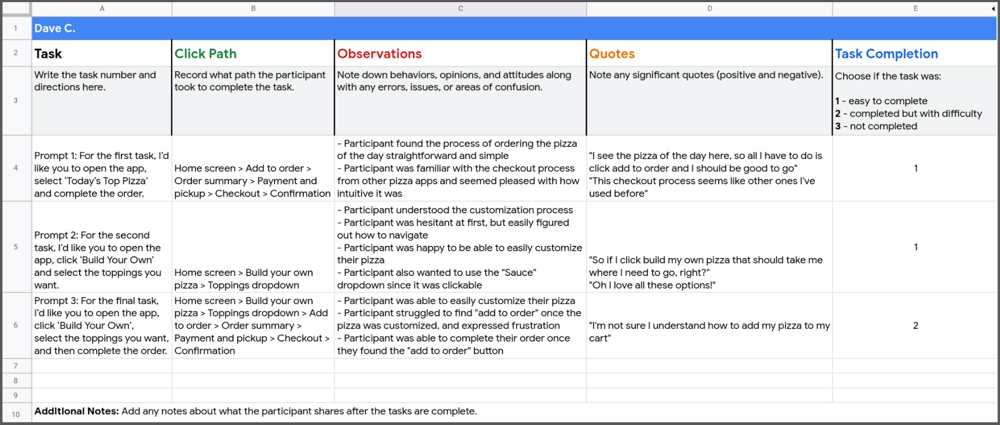

### 3. Analyzing and synthesizing research results

- Step 1: Gather the data
- Step 2: Organize the data
- Step 3: Find themes/patterns in the data
- Step 4: Develop insights from those themes

**Affinity diagram** is a method of synthesizing that organizes data into groups with common themes or relationships. To make an affinity diagram, all of the observations from your research study participants need to be transferred onto individual sticky notes. Each sticky note lists a single idea, observation, or direct quote from a participant. Then, cluster the observations and quotes into groups. Continue until there are no sticky notes remaining.

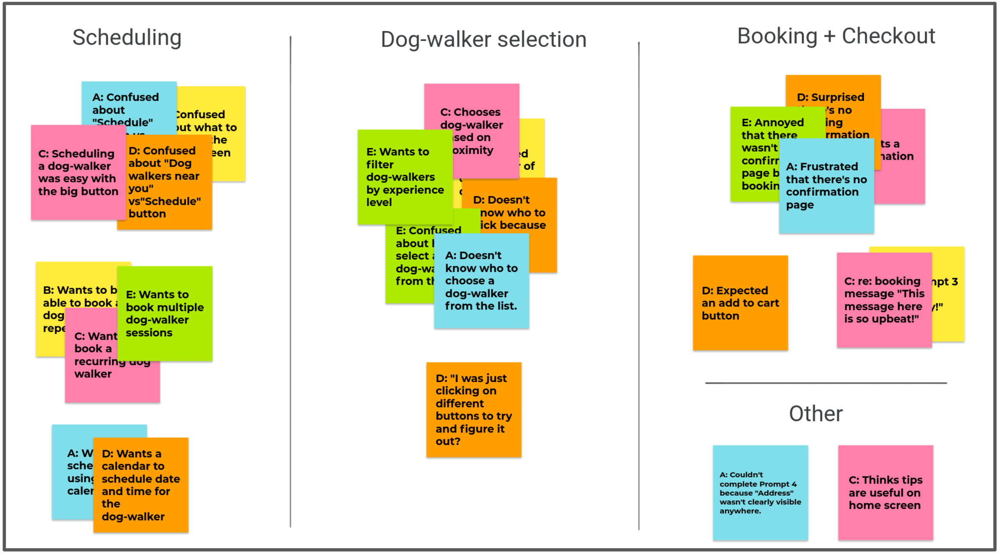

Quaities of a strong insight:

- Grounded in real data
- Answers the research questions
- Easy to understand
- Increases empathy for users
- Inspires direct action

Example of strong insights for Gmail:

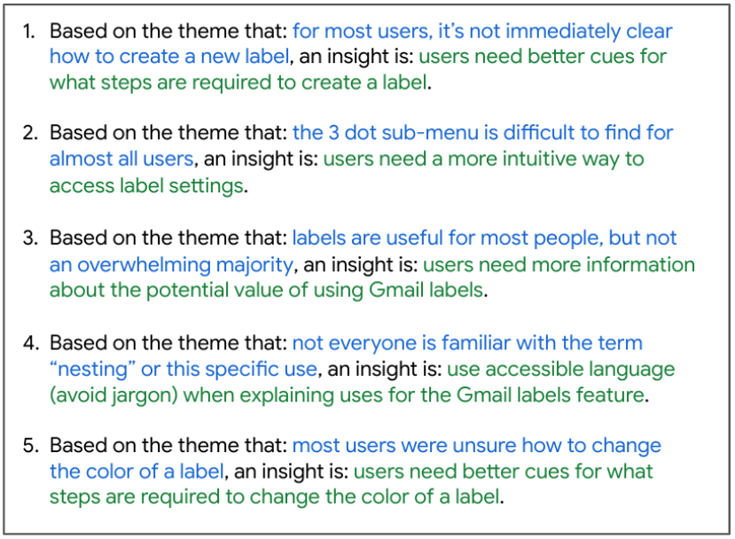

Priotizing insights:

- P0: Must be fixed for your product to work
- P1: Included in a future prototype to be tested
- ...

### 4. Sharing research insights

Two common formats for sharing insights with stakeholders are **presentations** and **research reports**:

Best practices for effective presentation:

- Provide an overview: Include a table of contents with **study details**, **themes**, **insights and recommendations**, and **appendix** sections.
- Show numbers.
- Less is more when it comes to text: Keep information short and to the point.
- Provide recommendations for next steps.
- Leave time for questions.

General tips for giving a presentation:

- Be concise.
- Keep a conversational tone.
- Use relatable stories and specific examples to illustrate points.
- Master the art of pause. Allowing natural pauses in conversation displays confidence.
- Make eye contact with different people in the audience.
- Overcoming stage fright:
  - Prepare.
  - Think positively.
  - Try a "power pose".
  - Don't hold your breath.
  - Get a good night's sleep.
  - Remember the goal: The audience will be focused on receiving the information they need, not watching your mistakes.
  - Know that it's okay to make mistakes.
- Handling questions and objections:
  - Know your material well.
  - Repeat the question.
  - Don’t get defensive.
  - Be concise.
  - Don’t rush to respond.

Based on your insights, you should now make changes to your low fidelity prototypes.

---

## Course 5: Create High-Fidelity Designs and Prototypes in Figma

### Visual design elements

#### Typography

**Type classification** is a general system to describe styles of type. Two of the most popular type classifications are **Serif** and **Sans Serif**.

A **typeface** is the overall style of a letter. Typefaces are distinguished by their stroke weight, shape, type of serif, and line lengths. Each typeface is known by a family name. Some examples of serif typefaces are Times New Roman, Georgia, and Cambria. A few examples of sans serif typefaces include Arial, Helvetica, and Verdana.

**Font** is the size, thickness, and emphasis of letters. The font can be more light or bold, italicized or regular, and even more variations. E.g. Roboto Bold in 12-point size, Roboto Thin in 18-point size, etc.

#### Color

Colors can convey emotions, signal actions, and add variety. Red, for example, attracts a lot of attention. That's why things like exit signs, emergency buttons, and stop signs are red. Objects with this color always get noticed. Blue on the other hand can communicate serenity and feelings of calmness or peace.

One common rule that UX designers use is the 60-30-10 rule. One neutral color makes up 60 percent of the color palette in your design. A second complementary color makes up 30 percent of the palette. A third accent color makes up 10 percent of the palette to add emphasis.

Accessibility considerations for color:

**Color blindness** results in difficulty distinguishing between certain colors. There are three common categories of color blindness: red-green, blue-yellow, and total color blindness.

People who have **low contrast sensitivity** experience objects as dim or unclear, which makes those objects more difficult for a person to identify. WCAG recommends using **luminosity contrast ratio** (4.5 : 1)

**Light sensitivity** is the inability to tolerate light. Users who have light sensitivity might experience your designs with a dim screen. Including light/dark/high contrast modes is recommended.

- Use icons in designs.
- Use patterns and texture to create contrast.
- Avoid color combinations that could be hard to distinguish.

#### Iconography

Icons are images or symbols that stand for specific actions or tools in an app or website. Using icons in your designs can quickly communicate concepts, instead of explaining a concept's meaning with words.

- Make icons universal.
- Consider including a text label.
- Keep branding clear.

#### Grids

A **basic grid** has intersecting lines that divide pages into small squares that allow you to easily lay out elements in a design. Basic grids are useful to help you design consistently, but UX designers more commonly use layout grids. A **layout grid** is a series of columns and alleys that allow you to organize elements in a design. Columns are the colored blocks, and alleys are the uncolored spaces between the columns.

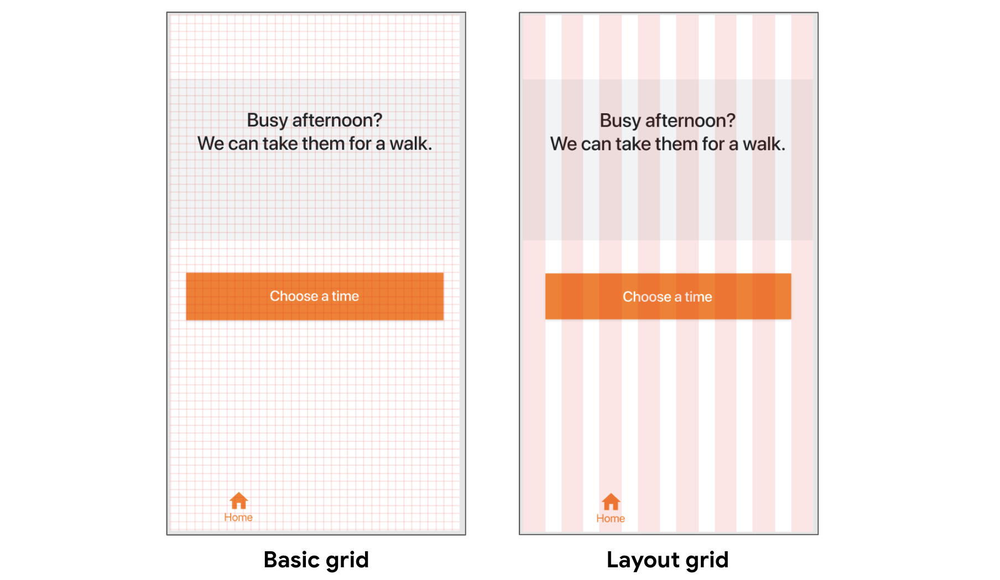

#### Containment

Containment uses visual barriers to keep designs neat and organized. There are four methods of containment: **dividers**, **borders**, **fill**, and **shadow**.

#### Negative space (White space)

White space is the gaps between elements in a design. Use of white space can provide emphasis on a focal point within the design, gives users a visual break, increases readability, and indicates if elements are related. Having too little white space increases the chance of error. Common ways of using white space are **line spacing**, **padding**, and **margin**.

#### Common design patterns in apps

Some common types of screen in existing design layouts of mobile apps:

- Home screen
- Onboarding screens
- Profile/Acccount screen
- Checkout screen

### Visual design principles

#### Emphasis

Emphasis means that an object or element is attracting attention. When part of a design has emphasis, the user’s eye is drawn there when they look at an app screen or webpage. Ways to add emphasis to designs:

- Size
- Contrast: creation of opposing visual elements
- Texture: elements within an object that add depth or a pattern to an object e.g. lines or shapes over an image that is used repeatedly

#### Hierarchy

Hierarchy helps the user know where to focus first and what action to take. **Hierarchy is different from emphasis** because it’s about guiding the user’s attention through groups of elements, instead of focusing on the importance of one particular element.

#### Scale and proportion

Scale is a concept that’s used to explain the size relationship between a given element and the other elements in the design. Proportion is about the balance or harmony between elements that are scaled.

#### Unity and variety

Unity measures how well design elements work together to create a consolidated design idea.

Variety refers to diversifying the elements in your design to break up monotony and create visual interest.

#### Value

While **Hue** refers to color families (like red, green, or blue), **Value** is a color’s lightness or darkness. The lightest value of any color is white and the darkest is black.

#### Saturation

Saturation refers to the intensity and richness of color.

#### Orientation

Orientation refers to the layout of your design. Orientation often corresponds with the platform or device you are designing for.

#### Intrinsic interest

Intrinsic interest refers to how eye-catching a visual element is to users. Certain design elements, like logos or animations, are meant to grab a user’s attention.

#### Perceived physical weight

Perceived physical weight is the illusion of weight and volume that each visual element conveys. When creating elements that simulate objects with physical weight, you’ll want each element’s dimensions to proportionately relate to the others.

#### Types of navigation

- Navigation bar
- Tab bar
- Navigation menu
- Navigation hub displays a collection of links on the homepage of the website.

An **affordance** is a visual cue of an object’s purpose within an interface. They “afford” you the opportunity to perform an action by providing you with hints about their context e.g. buttons and icons on the navigation.

### Design system

A design system is a series of reusable elements and guidelines that allow teams to design and develop a product following predetermined standards. Some of the visual elements frequently included in the design system are color, iconography, layout, copy, animation, elevation, typography, and illustration. Most design systems include

- Visual styles: colors palettes, typography, iconography, grid definitions
- Guidelines: design principles, editorial guidelines, implememtation guidelines
- UI patterns: elements, components, modules, templates
- Supporting code

### Sticker sheets/Design kits

Sticker sheets are a collection of elements and components that make up part of the design system.

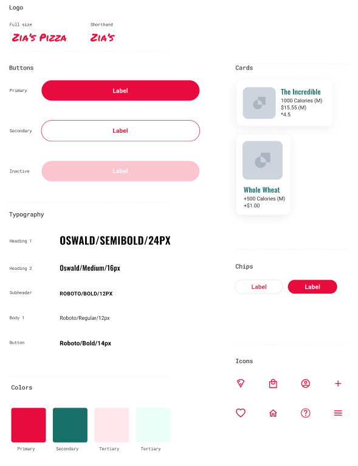

### Design critique session

A **design critique session** is a planned period where UX designers present their work to team members and listen to feedback. It is made up of 3 groups of participants:

- **Facilitator**: the in charge of running the critique session and guiding the feedback process.
- **Presenter**: the designer sharing their work with the team throughout the session.
- **Reviewer**: offers feedback on the designs presented and what steps are needed to improve the designs.
- **Notetaker (optional)**: documents the ideas and keeps track of all the feedback so the conversations can flow without interruption.

### Creating hi-fi prototypes in Figma

Six steps:

- Lay out the mockups
- Connect the screens
- Add interaction details
- Adjust the animation
- Complete for all screens
- Share your work

### Gestures and Motions

Gestures are any method of interaction that a user has with information on their device using touch e.g. tap, swipe, drag, pinch.

Motion is a way to animate static design elements to focus the user's attention and tell stories.

#### Accessibility considerations for gestures and motions

- Provide alternatives to using gestures
- Think critically about speed and durations about motions (recommended by W3C: under 5 seconds)
- Give users the ability to turn off a motion

Additional ways to enhance hi-fi prototypes are **sound**, and **video**.

### Identifying if a design is complete

Ask the following questions:

- Do the designs represent the intended user experience?
- Have placeholder text, icons, and imagery been replaced with finalized assets?
- Are participants or users able to interact with and interpret the designs without external guidance?
- Do the designs follow the existing design system?
- Do the designs follow common interaction patterns for their respective platforms?
- Do users have a clear path when something goes wrong?
- Is the design accessible?

### Case study

A case study should include these ten things:

- Your role in the project
- The goal of the project
- Your target audience
- Key challenges and constraints
- Research conducted
- Initial concepts or design strategy
- Your sketches or wireframes
- Results of any user testing
- Your final polished designs
- Conclusion

---

## Course 6: Responsive Web Design in Adobe XD

### Common website structures

- **Heirarchical** structure is a top-down approach that starts with top level categories of information referred to as the parent level. Then content is narrowed into more detailed information called the child level.
- **Sequential** structure leads users through a step-by-step process. Sequential websites order their pages from a starting page to an end point, sort of in a line.
- **Matrix/Web** structure allows users to follow their own path, since content is linked in several different ways.
- **Database** structure mixes a database, or an organized collection of information, with search functionality.

### Sitemap

A sitemap is a diagram of a website or an app that shows how pages are prioritized, linked, and labeled.

A **hierarchical sitemap** outlines the relationship between pages in order of importance.

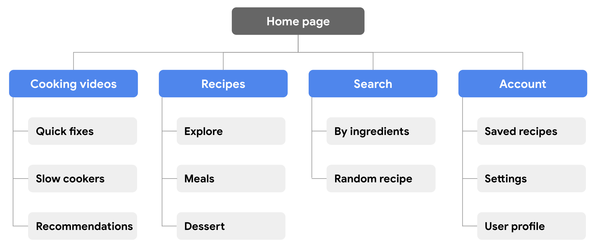

The rest of this course and course 7 (Design a User Experience for Social Good & Prepare for Jobs) go over everything we've learned above in a practical way and include details on how to use Figma and Adobe XD.
